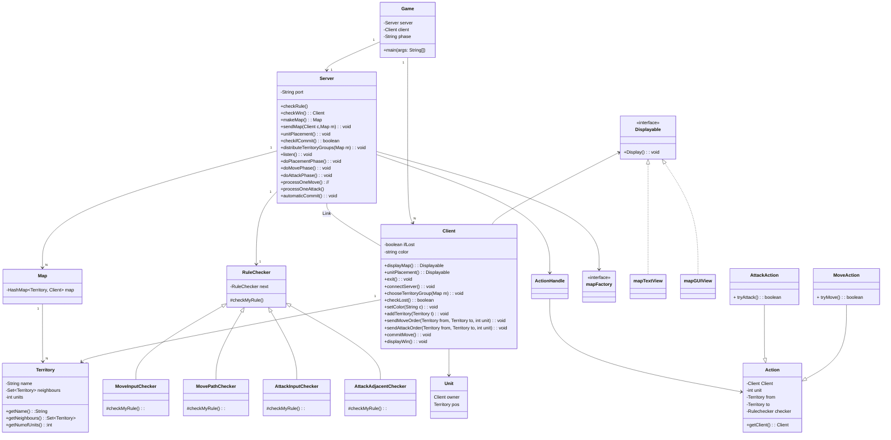

# Risk_Game

# Table of Contents

- [Review](#Review)
  - [Requirements](#Requirements)
- [Design Overview](#Design-Overview)
  - [UML Diagram](#UML-Diagram)
- [Implementation](#Implementation)

## Review

### Requirements

See requirements in [prj1.pdf](prj1.pdf)

## Design Overview

### UML Diagram

## Implementation
